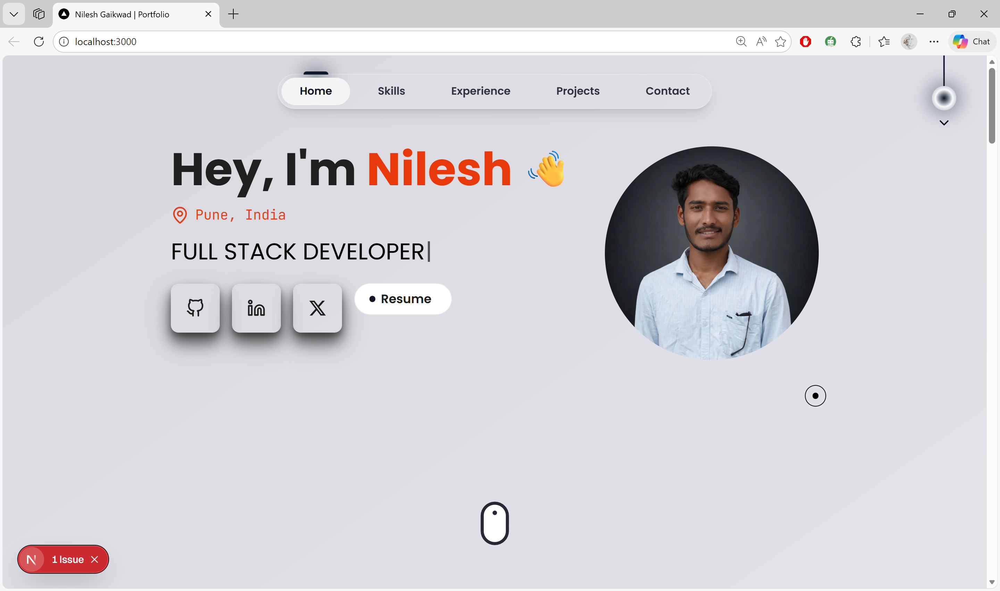

# 🚀 Nilesh Gaikwad Developer Portfolio

Welcome to my first ever portfolio website:  
🌐 **Live Demo : [nileshgaikwad/pages.dev](https://nileshgaikwad/pages.dev)**  
This site showcases who I am — developer, creator, and builder — in the simplest yet most impactful way.



---

## 📌 About Me

Hey, I’m **Nilesh Gaikwad**, currently pursuing **B.E in AIML** from **Pune University**. I love building modern web apps, exploring full-stack development,deployments and Cloud Infrastructures  My current tech stack revolves around the **MERN** ecosystem with a focus on **Next.js + TypeScript + DevOps**.

---

## 🛠️ Tech Stack

- **Framework:** Next.js 15 (App Router)
- **Language:** TypeScript
- **Styling:** Tailwind CSS + Custom Theme Tokens
- **Icons:** Lucide, React Icons
- **Forms & Mail:** EmailJS
- **Deployment:** Vercel
- **Animations:** Framer Motion
- **Design:** Mobile-first, fully responsive, dark/light mode

---

## ✨ Key Features

- 🌓 **Dark / Light Mode** (auto-detect + theme tokens)
- ⚡ Smooth scroll-to-section navigation
- 🧠 **Minimalist Design** with clean layout and shadows
- ✨ **Animated Navigation** with Framer Motion
- 📩 Working **Contact Form** via EmailJS + toast feedback
- 💼 Projects modal with rich details and hover effects

---

## 🧪 Running Locally

```bash
git clone https://github.com/nilesh-gaikwad01/nileshgaikwad-dev.git
cd nileshgaikwad-dev
npm install
npm run dev
````

> Make sure to add the following environment variables in a `.env.local` file if you're using EmailJS:

```env
NEXT_PUBLIC_EMAILJS_SERVICE_ID=your_service_id
NEXT_PUBLIC_EMAILJS_TEMPLATE_ID=your_template_id
NEXT_PUBLIC_EMAILJS_PUBLIC_KEY=your_public_key
```

---

## 📬 Contact Me

If you like my work, let’s get in touch:

* 📩 Email: [nileshngaikwad96@gmail.com](mailto:nileshngaikwad96@gmail.com)
* 🔗 [LinkedIn](https://linkedin.com/in/gaikwad-nilesh)
* 💻 [GitHub](https://github.com/nilesh-gaikwad01)

---

## 📄 License

This project is open source and free to use. Feel free to fork and build on top of it, just give credit where due.

---

### 💡 Bonus Tip

Want to use this portfolio as a base? Go for it. Clone it, customize it, and make it yours.

---

> Built with passion, pixels, and a little bit of Health.

---
